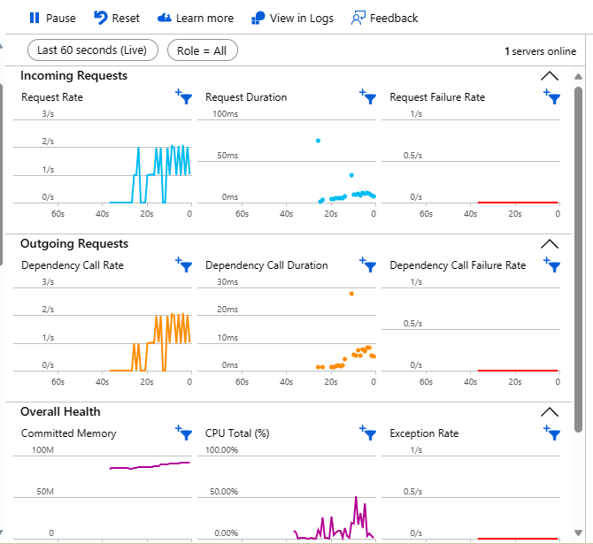
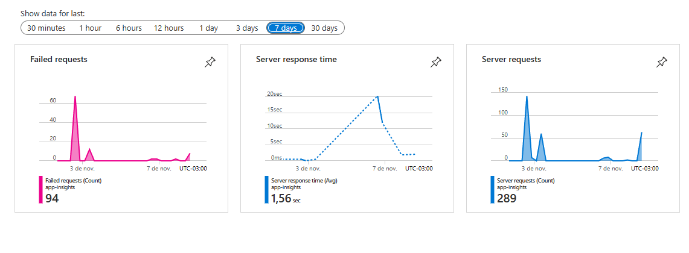
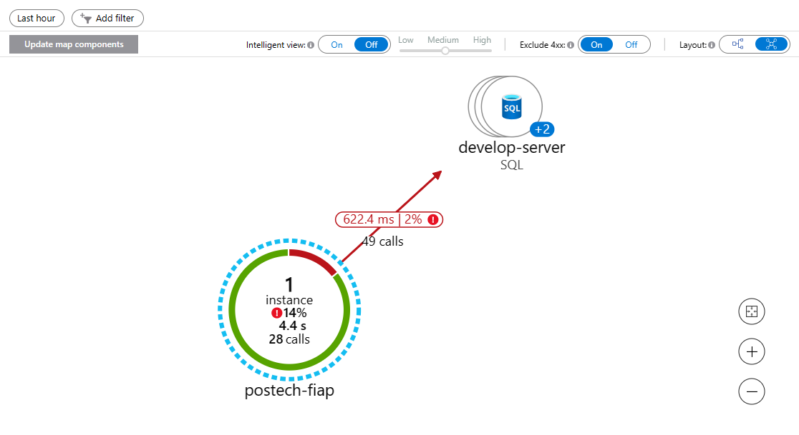

# Pós Tech Arquitetura de Sistemas .Net com Azure

## Dados Acadêmicos

Grupo:

Diego Alencar Silva

Eduardo Lopes Gomes

Fábio Henrique Rodrigues Godinho

## Dados técnicos

Github (Projeto original): https://github.com/diegoalencar5/fiap-TechChallengeNews

Github (Fork Fase 3): https://github.com/EduGomesTI/fiap-TechChallengeNews


API: https://postech-fiap.azurewebsites.net/swagger/index.html

Dados acesso API: { "username": "usuario_fiap", "password": "senha_fiap" }

Website: https://app-postech.azurewebsites.net

Obs.: O banco de dados utilizado é o SQL Database Free tier, então na primeira vez que o projeto é acessado pela url do site ou mesmo pelos endpoints da API, pode demorar para responder ou até mesmo retornar um internal error. Isto se dá porque depois de um período de inatividade nossa database entra em estado de 'hibernação', sendo que após isto é necessário um pouco de tempo para ela voltar a responder as requisições.

### Arquitetura

Nosso projeto utiliza Clean Architecture como arquitetura escolhida juntamente com CQRS.

A Clean Architecture é um padrão de arquitetura de software que enfatiza a separação clara de responsabilidades e a independência de frameworks. Ela organiza o código em camadas concêntricas, com o núcleo contendo regras de negócios independentes de tecnologia. Promove testabilidade, seguindo o princípio da inversão de controle, e adere ao princípio da única responsabilidade. É adequada para aplicativos complexos, facilitando a manutenção e a adaptação a mudanças tecnológicas.

A biblioteca MediatR é usada para a implementação do padrão Mediator.

O padrão Mediator é um padrão de projeto de software que promove o desacoplamento entre componentes em um sistema, facilitando a comunicação entre eles, principalmente quando se lida com operações de solicitação e resposta.

A função principal do pacote MediatR no .NET é facilitar a implementação do padrão Mediator em aplicativos .NET. Ele oferece uma maneira de separar a lógica de negócios e as operações de manipulação de solicitação/resposta, promovendo o baixo acoplamento entre os diferentes componentes de um aplicativo.

### Database

O banco de dados utilizado é o Azure SQL Database.

As credenciais de acesso estão no aasettings, e após a avaliação desta fase elas serão alteradas.

São utilizadas apenas 2 tabelas.

A tabela User guarda as informações de usuários para login, já a tabela Noticia guarda as notícias cadastradas pelo sistema.

### Endpoints

Uma coleção com todos os endpoints estão na pasta devops, sendo que eles são para o Thunder Client do VS Code.

Através da url da API pode-se acessar todos os endpoints da aplicação com excessão dos endpoints de Helath Check.

### Testes

Atualmente o projeto conta com 13 testes, sendo que 10 são testes unitários e 3 são de integração.

Os testes de integração utilizam o pacote TestContainers para isolar os testes da base de dados de produção, sendo assim conseguimos garantir os resultados satisfatórios dos testes.

__Obs.: Pelo fatos dos testes de integração utilizarem o TestContainers, se faz necessário estar rodando o Docker para realiza-los localmente.__

Cada teste de integração testa uma funcionalidade do sistema, um para adição de uma nova notícia, um para atualização de uma notícia e um para exclusão de uma notícia.

Os testes rodam automaticamente pela pipeline toda vez que um PR é aprovado na main.

### Application Insights

O Application Insights estã implemetado e configurado corretamente, sendo que através dele temos uma visão geral de algumas métricas do ssitema:







### Health Checks

https://postech-fiap.azurewebsites.net/status-json
https://postech-fiap.azurewebsites.net/status-text

Foram introduzido 2 health ckecks simples que retornam apenas o estado da API, sendo que para o banco de dados ainda não foi implementado.

## Fase 4

Obs.: Devido a utilização do RabbitMQ através de container não será possível executar o projeto através do Azure, somente localmente. Lembrando que a primeira vez que é enviado uma solicitação ao banco há um delay para a instância dele 'acordar' e isto pode causar erro de timeout. Repetindo a operação tudo fica normal.

Comando para rodar o container do RabbitMQ:
```
docker run -d --hostname my-rabbit --name some-rabbit -p 5672:5672 -p 15672:15672 rabbitmq:3-management
```